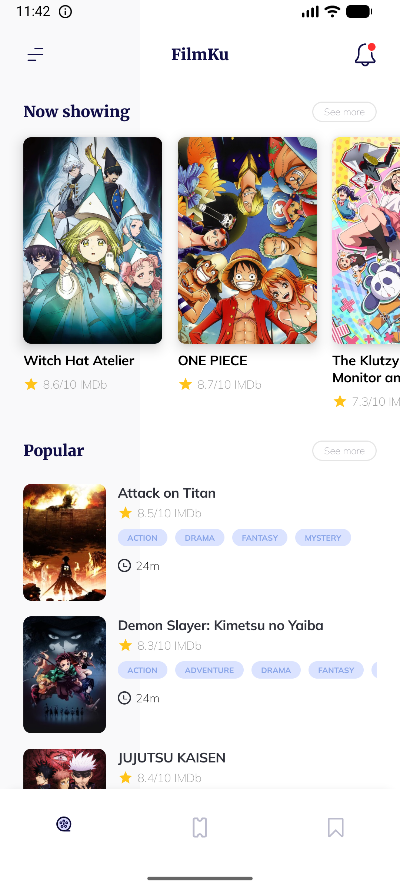
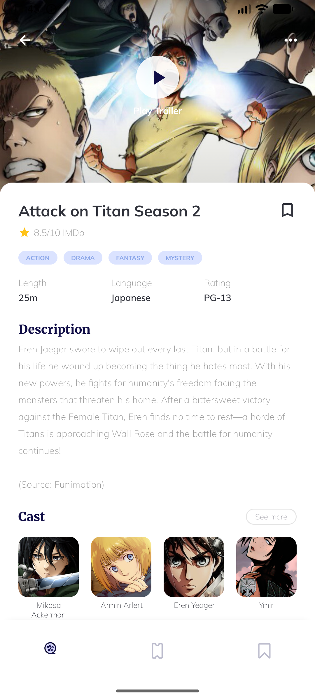
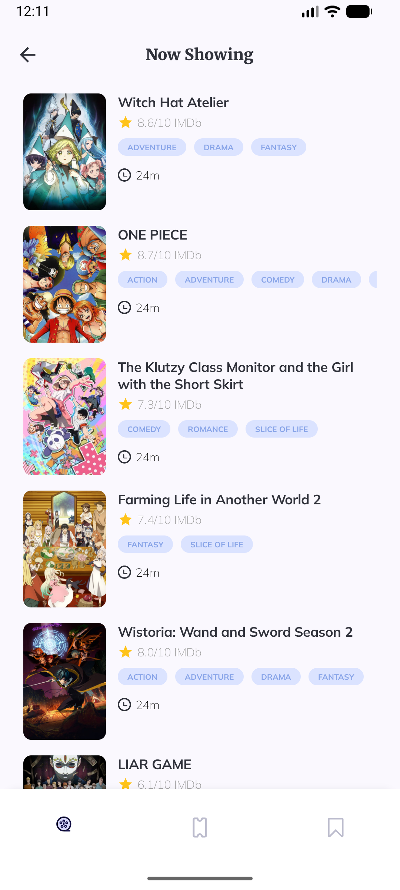

# Overview
You have been hired by a company that builds an app for Anime fans. You 
are responsible for implementing the Home screen on a brand new Android
project. The backend has been developed using GraphQL and there is a
more complex web client that uses it that you can check out here:
https://anilist.co/search/anime?format=MOVIE&sort=SCORE_DESC

# Data - GraphQL Schema:
https://studio.apollographql.com/sandbox/explorer?endpoint=https://graphql
.anilist.co&explorerURLState=N4IgJg9gxgrgtgUwHYBcQC4TADpIAR4AKA
hgOYJ474F6JgCWxluNNAzvSggKoBOANi1Z4UnfhSrCayUv3psAFkKlJiog
G4JlNAL7aCYBGyi96AB1EQk2vdVs6QAGhDrip4gCNxbDFmy9cBx0gA

# UI - Match the Figma design as closely as possible (pixel-perfect).
https://www.figma.com/design/cLub3jrsAqCdQzURbFvcsc/Movie-Mobile-A
pp-UI-Design-(Community)?node-id=0-1&p=f&t=ckDwQJvKEEXuYxju-0

# Technical Requirements
Use Kotlin and Jetpack Compose & follow best practices

## Screenshots

| Home | Detail | List |
|------|--------|--------|
|  |  |  |

## Tech Stack

| Layer | Technology |
|-------|-----------|
| Language | Kotlin |
| UI | Jetpack Compose, Material3 |
| Architecture | MVI — `Contract` (State / Event / Effect) + `ViewModel` |
| Dependency Injection | Hilt |
| Networking | Apollo Kotlin (GraphQL) |
| Image Loading | Coil |
| Navigation | Navigation Compose 2.8 — type-safe routes via `kotlinx.serialization` |
| Async | Kotlin Coroutines & Flow |

## Architecture

The project follows Clean Architecture with three layers:

- **Domain** — pure Kotlin models and the `AnimeRepository` interface; no Android dependencies
- **Data** — `AnimeRepositoryImpl` maps Apollo GraphQL responses to domain models
- **Presentation** — one package per screen (`home`, `detail`, `animelist`), each containing a `Contract`, `ViewModel`, and `Screen` composable

No dedicated reducer was added because each screen's state is a single `UiState<T>` field with trivial Loading/Success/Error transitions — a reducer would add an extra layer without centralizing any real complexity.

